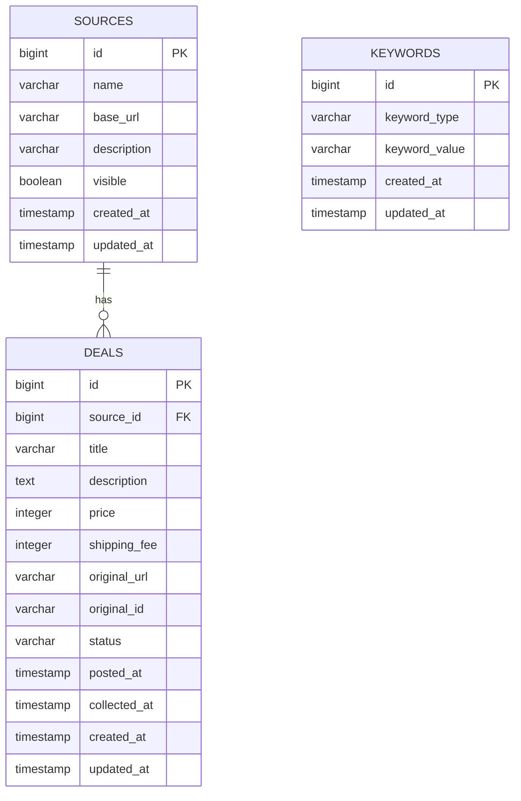

# Pick Deal DB 설계 초안

## 1. 설계 원칙

- MVP는 단일 사용자 개인용 서비스를 기준으로 한다.
- 출처, 핫딜, 키워드를 핵심 테이블로 둔다.
- 실제 수집기와 AI 요약은 후속 확장 테이블로 분리한다.
- 가격, 배송비처럼 없을 수 있는 값은 nullable로 둔다.
- 외부 원문 URL은 저장하되 원문 전체 복제는 최소화한다.

## 2. 핵심 테이블

### sources

출처 사이트 정보를 저장한다.

| 컬럼 | 타입 | 제약 | 설명 |
| --- | --- | --- | --- |
| id | bigint | PK | 출처 ID |
| name | varchar(100) | not null | 출처명 |
| base_url | varchar(500) | not null | 기본 URL |
| description | varchar(500) | nullable | 출처 설명 |
| visible | boolean | not null | 목록 표시 여부 |
| created_at | timestamp | not null | 생성 시각 |
| updated_at | timestamp | not null | 수정 시각 |

인덱스:

- `idx_sources_visible` on `visible`

### deals

핫딜 정보를 저장한다.

| 컬럼 | 타입 | 제약 | 설명 |
| --- | --- | --- | --- |
| id | bigint | PK | 핫딜 ID |
| source_id | bigint | FK | 출처 ID |
| title | varchar(300) | not null | 제목 |
| description | text | nullable | 설명 또는 요약 |
| price | integer | nullable | 가격 |
| shipping_fee | integer | nullable | 배송비 |
| original_url | varchar(1000) | not null | 원문 URL |
| original_id | varchar(200) | nullable | 출처 내 원문 ID |
| status | varchar(30) | not null | 상태 |
| posted_at | timestamp | nullable | 원문 게시 시각 |
| collected_at | timestamp | nullable | 수집 시각 |
| created_at | timestamp | not null | 생성 시각 |
| updated_at | timestamp | not null | 수정 시각 |

상태 후보:

- `ACTIVE`: 노출 가능
- `SOLD_OUT`: 품절
- `EXPIRED`: 종료
- `HIDDEN`: 수동 숨김

인덱스:

- `idx_deals_source_id` on `source_id`
- `idx_deals_created_at` on `created_at`
- `idx_deals_posted_at` on `posted_at`
- `uk_deals_source_original_url` unique on `source_id`, `original_url`

### keywords

관심 키워드와 제외 키워드를 저장한다.

| 컬럼 | 타입 | 제약 | 설명 |
| --- | --- | --- | --- |
| id | bigint | PK | 키워드 ID |
| keyword_type | varchar(30) | not null | `INTEREST` 또는 `EXCLUDE` |
| keyword_value | varchar(100) | not null | 키워드 값 |
| created_at | timestamp | not null | 생성 시각 |
| updated_at | timestamp | not null | 수정 시각 |

인덱스:

- `idx_keywords_type` on `keyword_type`
- `uk_keywords_type_value` unique on `keyword_type`, `keyword_value`

## 3. ERD 초안

## 4. MVP 조회 기준

핫딜 목록 조회 시 기본 조건:

- `sources.visible = true`
- `deals.status = 'ACTIVE'`
- 제외 키워드가 제목 또는 설명에 포함되지 않음

관심 키워드는 두 가지 방식 중 하나로 적용한다.

- 필터 방식: 관심 키워드 중 하나라도 포함된 핫딜만 노출
- 강조 방식: 모든 핫딜을 노출하되 매칭된 관심 키워드를 응답에 포함

MVP에서는 사용자 경험을 넓게 보기 위해 강조 방식을 기본으로 하고, 추후 설정 옵션으로 필터 방식을 제공한다.

## 5. 시드 데이터 예시

초기 개발용 데이터는 다음 수준으로 충분하다.

### sources

| name | base_url | visible |
| --- | --- | --- |
| Example Deals | https://example.com | true |
| Community Hotdeal | https://community.example.com | true |
| Hidden Sample | https://hidden.example.com | false |

### keywords

| type | value |
| --- | --- |
| INTEREST | 마우스 |
| INTEREST | 키보드 |
| EXCLUDE | 리퍼 |
| EXCLUDE | 중고 |

## 6. 향후 확장 테이블

### collector_runs

수집 실행 이력을 저장한다.

| 컬럼 | 설명 |
| --- | --- |
| id | 실행 ID |
| source_id | 출처 ID |
| status | 실행 상태 |
| started_at | 시작 시각 |
| finished_at | 종료 시각 |
| collected_count | 수집 건수 |
| error_message | 에러 메시지 |

### deal_comments

핫딜 댓글을 저장한다.

| 컬럼 | 설명 |
| --- | --- |
| id | 댓글 ID |
| deal_id | 핫딜 ID |
| author_name | 작성자명 |
| content | 댓글 내용 |
| posted_at | 작성 시각 |
| collected_at | 수집 시각 |

### deal_comment_summaries

AI 댓글 요약 결과를 저장한다.

| 컬럼 | 설명 |
| --- | --- |
| id | 요약 ID |
| deal_id | 핫딜 ID |
| summary | 요약문 |
| pros | 장점 요약 |
| cons | 단점 요약 |
| caution | 주의사항 |
| model_name | 사용 모델 |
| generated_at | 생성 시각 |

### deal_price_histories

가격 변경 이력을 저장한다.

| 컬럼 | 설명 |
| --- | --- |
| id | 이력 ID |
| deal_id | 핫딜 ID |
| price | 가격 |
| shipping_fee | 배송비 |
| observed_at | 관측 시각 |

## 7. 다중 사용자 확장

다중 사용자를 지원할 경우 다음 변경이 필요하다.

- `users` 테이블 추가
- 출처 표시 설정을 `user_source_settings`로 분리
- 키워드에 `user_id` 추가 또는 `user_keywords` 테이블로 변경
- 알림 설정을 사용자별로 저장
